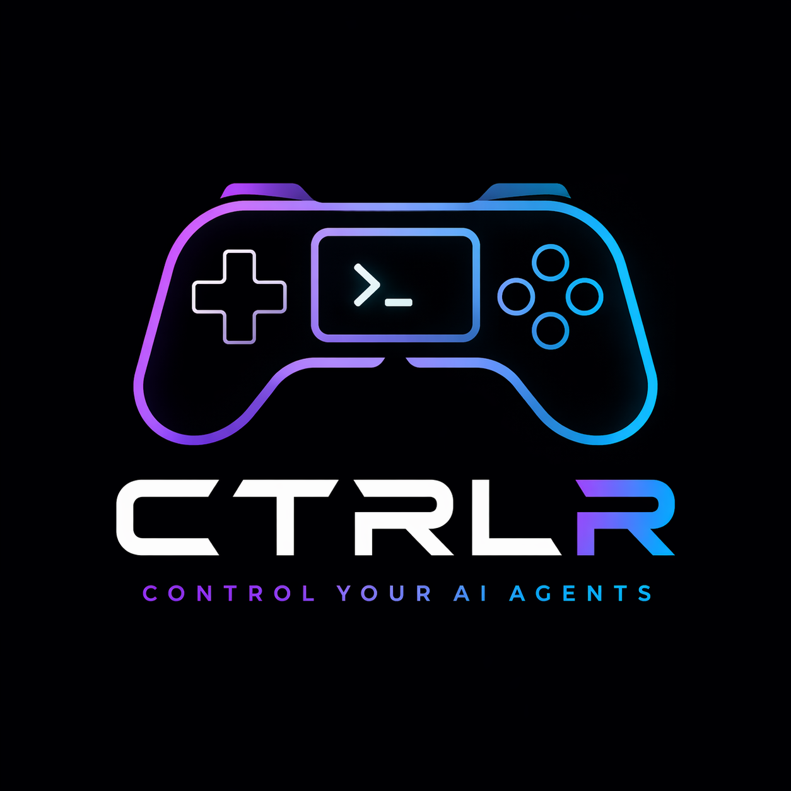

<div align="center">



# Ctrlr

**Control your AI agents like a game controller.**

A local-first multi-agent orchestration platform. Spawn a grid of terminal AI agents (Claude Code, Aider, your favorite REPL) and drive them with a USB gamepad. Press **A** to pick option 1. Flick the **stick** to switch panes. Hit **RB** to broadcast.

[](https://github.com/mpge/ctrlr/actions/workflows/ci.yml)
[](LICENSE)
[](package.json)
[](https://github.com/mpge)

</div>

---

## Why

Multi-agent workflows are real now: while one Claude pane writes the API, another writes the UI, a third writes tests. The bottleneck stops being the model and starts being **you** — the human switching focus, picking from numbered prompts, broadcasting commands.

Ctrlr puts that loop in your hands literally. The `A`/`B`/`X`/`Y` face buttons map to Claude's `1`/`2`/`3`/`4` prompts. The bumpers cycle panes. The stick is a hardware focus switcher. It feels like playing a game and that's the point.

## What it does today

- **Real USB controller detection** via [`node-hid`](https://github.com/node-hid/node-hid) — Xbox One/Series, DualShock 4, DualSense, plus a generic HID fallback.
- **Live grid of AI agents** rendered with [`ink`](https://github.com/vadimdemedes/ink) + [`@xterm/headless`](https://github.com/xtermjs/xterm.js). Each pane is a real PTY (`node-pty`); Claude Code, vim, htop all render correctly inside cells.
- **Configurable bindings** in plain `ctrlr.bindings.json` (zod-validated, JSON-schema autocomplete in VS Code).
- **CLI surface**: `init`, `start`, `stop`, `send`, `controllers`, `bind`.
- **Cross-platform**: Linux, macOS, Windows. CI runs the matrix on every push.
- **Local-first**: nothing phones home. The IPC channel is a Unix socket / Windows named pipe inside `.ctrlr/`.

## 30-second demo

```bash
npm install -g @ctrlr/cli
cd my-project
ctrlr init                # writes ctrlr.config.json + ctrlr.bindings.json
ctrlr controllers         # confirm your gamepad is detected
ctrlr start               # launch the TUI grid
```

The face buttons now type `1`/`2`/`3`/`4` into the focused pane. Use the bumpers (or flick the left stick) to switch focus. Press **Ctrl-Q** to quit.

## What it looks like

```
╔════════════ Pane 1 ══════════════╗  ╭──────────── Pane 2 ────────────╮
║ ● running                         ║  │ ● running                       │
║ > Refactor src/api/users.ts to    ║  │ > Add Tailwind dark mode toggle │
║   use the new repo pattern.       ║  │   to the layout shell.          │
║   1) yes                          ║  │   1) yes                        │
║   2) no, tell me what's different ║  │   2) no, change the approach    │
║   3) skip                         ║  │   3) cancel                     │
║   _                               ║  │   _                             │
╚═══════════════════════════════════╝  ╰─────────────────────────────────╯
╭──────────── Pane 3 ──────────────╮  ╭──────────── Pane 4 ─────────────╮
│ ● running                         │  │ ● running                       │
│ vitest run                        │  │ # Documentation                 │
│  ✓ engine.test.ts (4)             │  │ Drafting CHANGELOG…             │
│  ✓ resolver.test.ts (4)           │  │                                 │
╰───────────────────────────────────╯  ╰─────────────────────────────────╯
╭ ctrlr · 🎮 Xbox Wireless Controller · focus: Pane 1 ───── Ctrl-Q quit ╮
│ A: pick 1   B: pick 2   X: pick 3   Y: pick 4   LB: prev   RB: next   │
╰───────────────────────────────────────────────────────────────────────╯
```

Focused pane gets a double-line accent border. Status bar shows controller, focused agent, and the live binding hints.

## Default bindings

| Button | Action                                    | Default mapping                          |
| ------ | ----------------------------------------- | ---------------------------------------- |
| **A**  | Send `1\n` to focused pane                | Claude prompt option 1                   |
| **B**  | Send `2\n`                                | Claude prompt option 2                   |
| **X**  | Send `3\n`                                | Claude prompt option 3                   |
| **Y**  | Send `4\n`                                | Claude prompt option 4                   |
| **LB** | Cycle focus to previous pane              |                                          |
| **RB** | Cycle focus to next pane                  |                                          |
| **D-pad ↑/→/↓/←** | Focus pane 1 / 2 / 3 / 4       |                                          |
| **BACK**  | Send Ctrl-C to focused pane            |                                          |
| **START** | Restart the focused agent              |                                          |
| **GUIDE** | Broadcast `clear` to all panes         |                                          |
| **L stick →/←** | Cycle next / prev pane           | Same as LB / RB but hands-free           |
| **LT / RT** | Reserved (intensity, see roadmap)    |                                          |

Override any of this in `ctrlr.bindings.json`. See [packages/bindings/README.md](packages/bindings/README.md) for the full action vocabulary.

## Architecture

```
                ┌──────────────────────────────────────────────┐
                │                @ctrlr/core                    │
                │                  Engine                       │
                │  ┌──────────────┐    ┌──────────────────┐    │
                │  │  resolver    │───▶│ action dispatch  │    │
                │  └──────────────┘    └──────────────────┘    │
                └──────▲────────────────────┬──────────────────┘
                       │                    │
   ControllerEvent     │                    │   write/restart/focus
                       │                    ▼
   ┌─────────────────────────┐    ┌────────────────────────────┐
   │ @ctrlr/controller-input │    │      @ctrlr/pane-host      │
   │  ControllerManager      │    │       LocalPtyHost          │
   │  ┌──────────────────┐   │    │   ┌────────────────────┐   │
   │  │  HID parsers     │   │    │   │  node-pty children │   │
   │  │  Xbox · PS · gen │   │    │   │  + xterm-headless  │   │
   │  └──────────────────┘   │    │   └────────────────────┘   │
   └─────────────────────────┘    └─────────────┬──────────────┘
                                                │ snapshots
                                                ▼
                                ┌────────────────────────────────┐
                                │         @ctrlr/tui             │
                                │     ink grid + status bar      │
                                └────────────────────────────────┘
```

Each layer is a separate npm-publishable package so you can drop-in alternatives — write a `TmuxPaneHost`, a `WebHIDController`, or a remote-agent transport without touching anything else.

## Repository layout

```
ctrlr/
├── apps/
│   └── cli/                    # `ctrlr` command-line entry point
├── packages/
│   ├── types/                  # shared TypeScript types (no runtime deps)
│   ├── controller-input/       # node-hid + Xbox/PS/generic HID parsers
│   ├── bindings/               # zod schema + loader + defaults
│   ├── pane-host/              # PaneHost interface + LocalPtyHost
│   ├── tui/                    # ink + xterm-headless grid renderer
│   └── core/                   # Engine: input → bindings → actions → panes
├── schema/                     # JSON Schema for ctrlr.bindings.json
├── examples/                   # Drop-in starter configs
├── assets/                     # Brand assets (logo, palette)
└── .github/workflows/          # CI matrix + release pipeline
```

## Cross-platform support

| OS      | Status            | Notes                                                                                       |
| ------- | ----------------- | ------------------------------------------------------------------------------------------- |
| Linux   | ✅ first-class    | Needs `libudev-dev` and `libusb-1.0-0-dev` for `node-hid`.                                  |
| macOS   | ✅ first-class    | Just works.                                                                                  |
| Windows | ✅ supported      | Xbox controllers via Bluetooth or PS controllers work natively. USB-Xbox = XInput, see below.|

**The XInput situation on Windows.** Xbox controllers attached over USB on Windows expose `XInput`, which is a separate driver stack from HID. `node-hid` can't see them. Workarounds:

1. Pair the Xbox controller over Bluetooth — Windows then exposes it as HID.
2. Use a PlayStation controller instead — those use HID everywhere.
3. Run inside WSL2 with [`usbipd-win`](https://github.com/dorssel/usbipd-win) forwarding the device.

A native XInput backend is on the roadmap.

## Build from source

```bash
git clone https://github.com/mpge/ctrlr.git
cd ctrlr
pnpm install
pnpm build
pnpm test
pnpm ctrlr -- start              # run the CLI from the workspace
```

You'll need:

- Node.js ≥ 20
- pnpm ≥ 9 (`npm i -g pnpm`)
- A C/C++ toolchain for `node-hid` and `node-pty`. See [`CONTRIBUTING.md`](CONTRIBUTING.md) for OS-specific setup.

## Roadmap

- [ ] **Native XInput backend** so USB Xbox controllers work on Windows without Bluetooth.
- [ ] **Trigger intensity** — analog LT/RT used to scale "pace" actions (e.g. continuous scroll, send-rate).
- [ ] **Multiple controllers** — second-player vibes for collaborative agent sessions.
- [ ] **Remote agents** — `SshPaneHost` so a single controller can drive panes on different machines.
- [ ] **Ctrlr Studio** — a Tauri visual control surface with a controller diagram and live mapping UI.
- [ ] **WebHID adapter** — drive Ctrlr from the browser, no native build required.
- [ ] **Marketing site** at `ctrlr.co`.

PRs welcome on any of these.

## Contributing

See [CONTRIBUTING.md](CONTRIBUTING.md) for setup, code layout, and how the CI matrix works. PRs that add new controller parsers or pane-host backends are especially welcome — both are designed as plug-in interfaces.

## License

MIT © [mpge](https://github.com/mpge)
